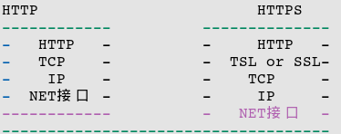

#SPIDER
>表示不会markdown 在github上都没有换行
>
>spider based on c
>plat is linux;
>
>start occasion is 2016.4.24
>end occasion is 2016.5.1

>今天是5月1日,自己一周项目的最终结束日期，其实到现在我的项目最的都是有问题的，我怀疑是程序将程序栈的资源
>吃完了，但是在这个过程中我收获了太多的东西：
>
>
>* git：
>
>之前只会用用git clone   ,  git add ,,  git commit  ,  git push   ,  并且对于 git branch , git checkout , 并不是很了解,
>到现在我可以说我会使用这些东西了，真的很方便， 比如在有一次我的一个示例文件被我删掉了，于是我用git checkout 恢复了
>
>* html:
>
>这个过程看了看这个东西，但是只是知道了我关心的东西怎么去获得里面的链接
>
>* http:
>
>学会了怎么通过http协议抓取数据， 理解了两个方法HEAD, GET， 请求和验证
>通过这里我觉得我的json解析也可以拿出来再做,我可以利用http协议，抓取json数据包，从而获得我关心的天气情况
>然后结合一些可视化的知识完成一个自己的天气预报
>
>
>* https：
       >
       >我的天呢，对于一部分的网页支持https的同时也支持http，但是对于像 github这样的只支持https，好吧，我就去查了区别
       >
      >* secure
      >明文传输与ssl加密传输, RC4的加密
      >* 
      
      >
      >* port 80 443
     >
      >但是对于这部分的内容我还没有真正的用到 
      >
>* 时间流逝的感觉：
>
>1 week  太快了

未完成
# netBug
